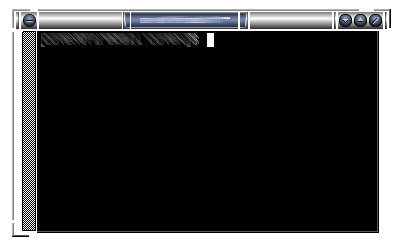
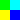
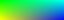

:homepage: https://ice-wm.org/themes
:imagesdir: https://ice-wm.org/themes
:toc:
:toc-placement!:
:!webfonts:

[[icewm-theme-creation-howto]]
IceWM Theme Creation Howto
--------------------------

*Adam Pribyl, covex@lowlevel.cz* +
MJ Ray, markj@stu.uea.ac.uk +
Last updated for IceWM-3.6.0.

toc::[]

[[what-is-an-icewm-theme]]
What is an IceWM theme?
~~~~~~~~~~~~~~~~~~~~~~~

An https://ice-wm.org[IceWM] theme is made up of these parts:

* one or more theme files, including a "default.theme", which should
specify all IceWM options related to appearance (color definitions) and
behaviour, in the usual preferences format of "Option=Value" on each
line; (some of the preferences/values are not allowed to change in theme
specification)
* a collection of pixmaps (XPM and PNG files) which are used for
building the window decorations;
* a collection of pixmaps (XPM and PNG files) for cursors, special
icons, mailbox and task bar;

*It should not contain a large backdrop graphic or specify any options
not related to its appearance.*

Both the theme file(s) and the decoration pixmaps live in a single
subdirectory under `ICE-LIB/themes`, where `ICE-LIB` is either the IceWM
system directory or a users' `.icewm` directory. Themes then appear in
the "Themes" item on the program menu. The default theme on startup is
set in the `theme` file or by the `-t` option in the command line.

[[types-of-icewm-themes]]
Types of IceWM themes
~~~~~~~~~~~~~~~~~~~~~

There are several types of theme possible, chosen by setting the
*"Look"* option to one of the values: **_warp3_**; **_warp4_**;
**_win95_**; **_motif_**; **_nice_**; **_pixmap_**; **_metal_**;
**_gtk_**. These each give you different levels of control over the
appearance and require different numbers of pixmaps.
(Actually, pixmap, metal and gtk are similar.)

In this howto, we will cover the most general **_pixmap_** Look,
because other looks generally need a subset of the pixmaps. Look in the
system `ICE-LIB/themes` directory at the basic themes if you want to
know how they compare.

[[pixmaps-creation-tools]]
Pixmaps creation tools
~~~~~~~~~~~~~~~~~~~~~~

Most people use some combination of a paint package - GIMP and xpaint
can create XPM and PNG files - and a text editor to create and correct
XPM pixmaps.
If the text editor has configurable syntax highlighting and the pixmaps
are smaller than your screen, this is a simple way to work closely on a
zoomed preview.

[[pixmap-requirements]]
Pixmap requirements
~~~~~~~~~~~~~~~~~~~

(Hint: pixmaps are quite simple files, really. If you don't know them,
try looking at a few: there's a header giving image and palette sizes,
then the palette, then the image.)

Pixmap naming is methodical, even if it looks a little unfriendly.
Each part of the window is a separate pixmap and the start of the name
specifies which part (eg "close" is the close button and "frame" is a
window frame section). The next letter is *"A"* for an *active*
(focussed) window version or *"I"* for an *inactive* window. Some parts
(frame sections and title bars) then have a character to denote which
part it is. Finally, you have ".xpm" on the end.

You can use XPM and PNG files with all available features like
transparency.
This way you can create particulary transparent frames, titles, buttons,
etc.

[[title-bar-buttons]]
Title Bar Buttons
^^^^^^^^^^^^^^^^^

Which buttons are prepared in your theme is specified by the
*TitleButtonsSupported* option in the theme file. *TitleButtonsLeft* and
*TitleButtonsRight* (see preferences file) says which buttons to place
where (you can use less buttons than you have under
TitleButtonsSupported). The letters are shown after the button names:

- **close (x)**
- **hide (h)**
- **maximize** and **restore (m)**
- **menuButton (s)**
- **minimize (i)**
- *rollup* and *rolldown (r)*
- *depth (d)*

and are followed by *A.xpm* or *I.xpm* as before.
There is one more suffix for button pixmaps only - **"O"**. It
specifies pixmap for button when mouse cursor is **over** this button.
For this feature to work you need to set `RolloverButtonsSupported=1`.
_Please_ set your theme's TitleButtonsSupported to include all buttons
you have and _not more_.

Each button has two appearances in a pixmap-look theme: a _normal_ and a
_pressed_ version. The pixmaps used are slightly unusual to accommodate
this, being twice the size vertically, with the pressed version below
the normal one. So, if you are using 16x16 buttons, your pixmaps will be
16x32 and be two pixmaps in one, effectively.

[[frames]]
Frames
^^^^^^

_Window frame pixmaps_ are *"frame"* followed by *A* or *I* and a
location specifier.

_Dialogue box frames_ are *"dframe"* instead. The locations are fairly
logical and same for both frames and dframes:

....
              ,TL --------- T -------- TR.
              |                          |
              L                          R
              |                          |
              `BL --------- B -------- BR'
....

(think **T**op, **B**ottom, **L**eft and **R**ight)

[[title-bar]]
Title Bar
^^^^^^^^^

The _title bar_ is composed of pixmaps, specified as **"title"**, then
*A* or *I*, then the location.

////
This is deprecated since icewm 1.2.7 +
 +
Since late in the 0.9.x series, a two new forms are supported. If
`TitleBarCentered=0` the locations are:

....

              ,-----------------------.
              | L   P   T   M   B   R |
              `-----------------------'
....

This is deprecated since icewm 1.2.7 or for `TitleBarCentered=1`: +
 +
This can be replaced with option `TitleBarJustify=50`
////

Valid title bar pixmaps are now:

....
              ,-----------------------.
              J L  S  P   T   M  B  R Q
              `-----------------------'
....

where the title text appears on top of the T pixmap (think basic letters
**L**eft, **S**pace, **T**itle, **M**iddle, **B**ulk, **R**ight). Space
fills everything between *L* and *P* pixmap, same applies for **B**ulk.

You do not need to define all frames and titles as pixmaps. Instead of
this you can use definitions of colors and sizes in default.theme file.
(Then you are defining borders and border colors for frames, etc.)

[[border-and-frames-summary]]
Border and frames summary
^^^^^^^^^^^^^^^^^^^^^^^^^

[cols="^1,^1,^1,^1,^1"]
|===

| frame?TL
| frame?TL
| frame?T
| frame?TR
| frame?TR

| frame?TL
3+^| _TITLE BAR (see below)_
| frame?TR

| frame?L
3+|
| frame?R

| frame?BL
3+|
| frame?BR

| frame?BL
| frame?BL
| frame?B
| frame?BR
| frame?BR

|===

Where each _?_ is either *A* or *I* (for active/inactive).
The title bar is:

[cols="^1,^1,^1,^1,^1,^1,^1,^1,^1,^1,^1"]
|===

| title?J
| menuButton
| title?L
| title?S +
  fill
| title?P
| title?T +
  fill + text
| title?M
| title?B +
  fill
| title?R
| "buttons"
| title?Q

|===

Here is an example of a possible Infadel theme frame and title
decomposition:

{nbsp}{nbsp}{nbsp}{nbsp}{nbsp}{nbsp}{nbsp}{nbsp}

[[taskbar-themeability]]
Taskbar themeability
~~~~~~~~~~~~~~~~~~~~

The taskbar in IceWM is also themeable.
You need four pixmaps to change whole taskbar look
(the names are self explaining):

....
    taskbarbg.xpm
    taskbuttonbg.xpm
    taskbuttonactive.xpm
    taskbuttonminimized.xpm
....

For workspace buttons there are:

....
    workspacebuttonbg.xpm
    workspacebuttonactive.xpm
....

You can also change the *Start* button.

....
    start.xpm
....

("icewm.xpm" and "linux.xpm" are now deprecated.)

Buttons for windows list and show desktop.

....
    windows.xpm
    desktop.xpm
....

The default toolbar button:

....
    toolbuttonbg.xpm
....

All pixmaps for the taskbar need to be in the subdirectory *taskbar*.
The size of the pixmaps does not matter, but you need to take in mind
that only the appropriate part will be used. E.g. for taskbarbg.xpm
only the upper 25 pixels (height of taskbar) will be used from the
pixmap on a single line taskbar. If the pixmap is smaller than the
required size, then it will be scaled to the whole area it should fill.

[cols=",,,,,",]
|=======================================================================
| start.xpm
| taskbuttonbg.xpm
| taskbuttonactive.xpm
| taskbuttonminimized.xpm
| taskbarbg.xpm
| 12:34
|=======================================================================

[[clock]]
Clock
^^^^^

Even more, you can set clock to use pixmap digits. If you want to use
pixmap digits you need to put:

....
    a.xpm
    colon.xpm
    dot.xpm
    m.xpm
    n0.xpm ... n9.xpm
    p.xpm
    slash.xpm
    space.xpm
....

into the *ledclock* subdirectory under your theme.
Pixmaps heights should fit the taskbar. +

[[apm]]
APM
^^^

APM battery status can also use pixmap digits. Except those for clock
you can define

....
    percent.xpm
....

for "%" character. Place it also under **ledclock**.

[[mailbox]]
Mailbox Icons
^^^^^^^^^^^^^

Mailbox icons are also themeable. There are five states for this icon.

....
    errmail.xpm
    mail.xpm
    newmail.xpm
    nomail.xpm
    unreadmail.xpm
....

Pixmaps should be 16x16 pixel for now, stored in the *mailbox*
subdirectory.

[[collapse-button]]
Collapse button
^^^^^^^^^^^^^^^

Since IceWM 1.2.17 the taskbar has a collapse button.
This button is themable since 1.2.22. Use:

....
    collapse.xpm
    expand.xpm
....

and place them in the *taskbar* subdirectory.

[[resizing-taskbar]]
Resizing taskbar
^^^^^^^^^^^^^^^^

The taskbar height could be changed in two ways. Increase it either by
making the taskbar "start.xpm" icon higher (in 1.2.23 it is broken for
`TaskBarDoubleHeight=0`) or by changing the `SmallIconSize` pref.
The taskbar height is `SmallIconSize` + 9 pixels. Only if the height
`start.xpm` is higher than that, is it set to the height of `start.xpm`
plus 5 pixels.
Consider that when the taskbar height is changed, not all taskbar parts
are changed accordingly (e.g. the monitors).

[[icons]]
Icons
~~~~~

Very complex themes can also contain their own icons for folder, file or
other apps in *icons* subdirectory. By default 16x16 and 32x32 icons are
used. Nameing is just like this:

....
    folder_16x16.xpm    for folder icon size 16x16 pixels
    folder_32x32.xpm    for folder icon size 32x32 pixels
....

In e.g. menu file then it is enough to say

....
    menu "Mail Agents" folder {
    }
....

and folder icon with appropriate size and name will be used. IceWM also
accepts PNG files as icons, but you have to explicitely put the name
and/or path (if you do not add path to icons to IconPath pref).

....
    menu Applications "/home/test/my icons/myfolder.png" {
    }
....

The default sizes of icons could be set in prefs with *IconSize options.

[[other-buttons-and-backgrounds]]
Other Buttons and Backgrounds
~~~~~~~~~~~~~~~~~~~~~~~~~~~~~

Default active and inactive buttons:

....
    buttonA.xpm
    buttonI.xpm
....

Menu pixmaps:

....
    menusel.xpm
    menusep.xpm
    menubg.xpm
....

Background for dialogs and the window list:

....
    dialogbg.xpm
    listbg.xpm
    logoutbg.xpm
    switchbg.xpm
....

[[cursors]]
Cursors
~~~~~~~

Pointers for *resize* begin with *"size"* followed by frame part name
(e.g. *sizeTR.xpm* is pointer for resize **T**op **R**ight, same for
B, BL, BR, L, R, T, TL). Pointers for *scroll*
begin with *"scroll"* followed by L, R, U or D (think **L**eft,
**R**ight, **U**p, **D**own). Cursors are placed in *cursors*
subdirectory.

Direction cursors are:

....
    left.xpm
    right.xpm
    move.xpm
....

Resize cursors are:

....
    sizeR.xpm
    sizeTR.xpm
    sizeT.xpm
    sizeTL.xpm
    sizeL.xpm
    sizeBL.xpm
    sizeB.xpm
    sizeBR.xpm
....

Scroll cursors are:

....
    scrollL.xpm
    scrollR.xpm
    scrollU.xpm
    scrollD.xpm
....

Remember to define the
https://en.wikipedia.org/wiki/X_PixMap#XPM3[cursor hotspot].

....
    /* <width> <height> <colors> <chars-per-pixel> <x-hotspot> <y-hotspot> */
    "16 16 2 1 10 4",
....

[[gradients]]
Gradients
~~~~~~~~~

If you want to use gradients you have to have IceWM compiled with
gradient support. Then in theme definition file you simply include line
like this:

....
    Gradients="menubg.xpm titleAS.xpm titleAT.xpm titleAB.xpm titleIS.xpm titleIT.xpm titleIB.xpm"
....

Pixmaps for gradient definition can contain only a few pixels. These
define what colors are used to create the gradient. For example this
definition (zoomed 1:10):

{nbsp}{nbsp}{nbsp}{nbsp}{nbsp}{nbsp}{nbsp}{nbsp}{nbsp}{nbsp}{nbsp}{nbsp}

looks like this when used in titleAS.xpm:

{nbsp}{nbsp}{nbsp}{nbsp}{nbsp}{nbsp}{nbsp}{nbsp}{nbsp}{nbsp}{nbsp}{nbsp}

You can use almost any picture, but you have to take in mind that this
image will be blurred inside e.g. whole S area. (This is different to
non gradient themes - there S images are not blured, but placed many
times in S area - it fills the area like a repeat pattern.)

[[themeability-by-colors]]
Themeability by colors
~~~~~~~~~~~~~~~~~~~~~~

By color settings in preferences you can set the color of almost every
part of IceWM. You can set colors of _Normal, Active, Minimized and
Invisible_ buttons and text colors for same categories of buttons.
(Search for *Color*TaskBar* options in preferences.)

You can also set **colors of monitors** and **clock background + font**.
Colors for **frames, taskbar, menu, tooltips, dialogs, listboxes,
scrollbars and desktop**.
You can combine pixmap and color themeability as you wish.
For details you need to look trough the IceWM preferences file.

Colors are specified in RGB hex format like `ColorApm="rgb:12/89/ef"`.
Since 1.6.0 an alpha component for translucency effects can be added
in two ways. Either add an opacity percentage between 1 and 100
enclosed in square brackets like `ColorApm="[80]rgb:12/89/ef"`,
or use RGBA hex format like `ColorApm="rgba:12/89/ef/cc"`.

[[default.theme]]
default.theme
~~~~~~~~~~~~~

The *default.theme* file is actually another preferences file, just like
`ICE-LIB/preferences`. There are three options which are customarily put
at the top of default.theme:

....
        ThemeDescripton="description of theme"
        ThemeAuthor="contact details"
        License="license type"
....

and I encourage you to do the same. It can also be useful to add some
comments (lines starting with a hash, #) to the top of the file,
suggesting other resources (e.g. backdrops) that you think would go
well with the theme.

Your default.theme file should set all options concerning appearance,
whether you think they will be used or not. It should not interfere with
the configuration of icewm unless it is essential to your appearance.
For example, it is not normally OK for a theme to decide to show the
TaskBar (this is usually left to the user's preferences file), but a
Windows95 lookalike theme would want to show a single-height task bar
for sure and set the look of the clock, etc.

If you wish, you can include other `.theme` files in your theme. These
will appear on the optional submenu for your theme (similar to how
"Restart" is on the optional submenu of "Logout") and give the user
several possible variations on a theme.

For examples you can see _preferences_ file from IceWM package which is
pretty self explaining.

[[testing-your-theme]]
Testing your theme
~~~~~~~~~~~~~~~~~~

When you are ready to test your theme for the first time, you need to
cause icewm to rebuild its menus, so that your new theme appears in the
"Themes" submenu. You can do this by either restarting icewm, or by
changing themes to something else, then you can change to your theme.
After changing you theme file, you must do the same.

[[packaging-your-theme]]
Packaging your theme
~~~~~~~~~~~~~~~~~~~~

Change to `ICE-LIB/themes` and do

....
        tar czvf themename.tar.gz themename
....

to make a tarball of your theme.

The home for IceWM themes is at
https://themes.ice-wm.org[box-look.org] these days.

[[this-document]]
This Document
~~~~~~~~~~~~~

The IceWM Theme Creation HOWTO is copyright 1999-2000 MJ Ray and 2003
Adam Pribyl, and may be freely reproduced unaltered but with
annotations. The latest version should always be on the
https://ice-wm.org[IceWM Website].
If you wish to improve this document, please send a message to
covex@lowlevel.cz.

// vim: set ft=asciidoc tw=72 nocin nosi fo+=tcqlorn:
